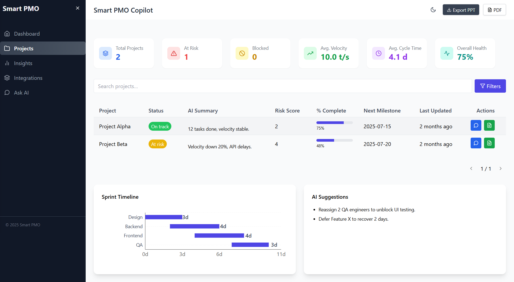
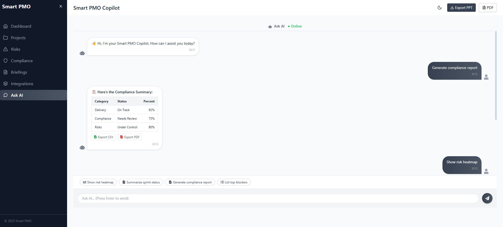

# Smart PMO Copilot – Frontend  

  
  
  
  

Smart **PMO Copilot** is an **AI-powered Project Management & Risk Monitoring Dashboard** built with **React + TailwindCSS + Recharts**.  

It helps **Project Managers, PMOs, and Engineering Leaders** with:  
📊 **Real-time project health** → risks, sprints, blockers, compliance.  
🤖 **AI Copilot** → auto-summaries, insights, recommendations.  
📑 **Exportable Reports** → download insights as **PDF/PPT** instantly.  

---

## ✨ Features (Current Version)

- 📊 **Dashboard** → Task status, sprint timeline, project health gauge, risk heatmap, SLA breaches, forecast alerts.  
- 📂 **Projects Page** → AI summaries, completion %, milestones, risk scores.  
- 💬 **Ask AI Chat** → Conversational AI assistant for queries (risks, blockers, reports).  
- 📑 **Export Options** → Export dashboards & chat insights as **PPT** or **PDF**.  
- 🎨 **Modern UI** → Responsive TailwindCSS layout, mobile-first friendly.  

---

## 🖼 Screenshots  

### Dashboard  
  

### Projects  
  

### Chat (Ask AI)  
  

---

## 🛣 Roadmap (Next Steps for SaaS)

- [ ] 📱 **Fix Mobile Responsiveness** → perfect mobile UI.  
- [ ] 🔗 **Integrations** → Jira, Trello, Asana, Azure DevOps.  
- [ ] 🔑 **Authentication** → JWT/OAuth2 (ready-to-use SaaS).  
- [ ] 🏢 **Multi-Tenant Support** → multiple organizations, roles (Admin, PM, Analyst).  
- [ ] 🤖 **AI Features** →  
   - Risk prediction  
   - Sprint summaries  
   - Automated compliance checks  
   - Auto-email notifications  
- [ ] ☁️ **Deployment Ready** → Docker + CI/CD + Vercel/Netlify builds.  

---

## 🛠 Tech Stack  

- **Frontend** → React, TailwindCSS, Recharts  
- **State Management** → React Hooks  
- **Exports** → jsPDF, pptxgenjs (for PDF/PPT)  
- **Routing** → React Router  
- **Deployment (planned)** → Vercel / Netlify / Docker  

⚡ Note: This is the **frontend-only demo**. Backend (FastAPI/Node.js) + database (PostgreSQL) will be added in future.  

---

## 🚀 Setup Instructions  

### 1. Clone Repository  
```bash
git clone https://github.com/ankit72630/smart-pmo-copilot.git
cd smart-pmo-copilot
```

### 2. Install Dependencies  
```bash
npm install
```

### 3. Run Locally  
```bash
npm start
```

👉 App runs at **http://localhost:3000**

---

## 🤝 Contribution  

Contributions, issues, and feature requests are welcome! 🎉  

1. Fork this repo  
2. Create a feature branch → `git checkout -b feature-name`  
3. Commit changes → `git commit -m "Add feature"`  
4. Push → `git push origin feature-name`  
5. Open a Pull Request  

---

## 📦 Deployment  

You can deploy easily with [Vercel](https://vercel.com) or [Netlify](https://www.netlify.com/).  

### Deploy to Vercel
```bash
npm run build
vercel deploy
```

### Deploy to Netlify
```bash
npm run build
netlify deploy
```

---

## 📜 License  

This project is licensed under the **MIT License** — free for personal & commercial use.  

---

## 💡 Why This Project is Valuable  

- 💼 Ready-to-use **PMO Dashboard** (managers love it).  
- 🎯 Built with **modern stack** (React, Tailwind, Recharts).  
- 📑 **Export-ready** → buyers see immediate value in reporting.  
- ⚡ Can be **extended to SaaS** with minimal backend additions.  

---

🚀 **Smart PMO Copilot = AI-powered Jira/Trello for PMOs**  
Perfect base to **sell as SaaS** or showcase in your portfolio.  
