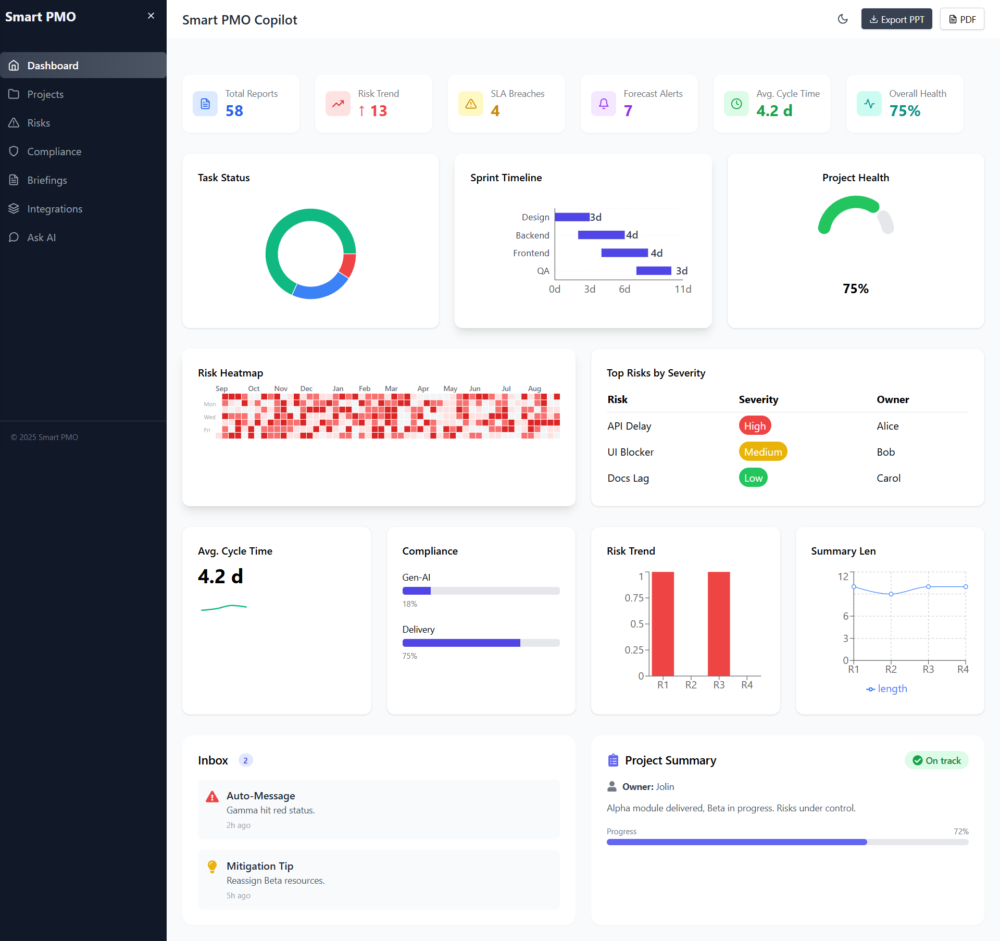
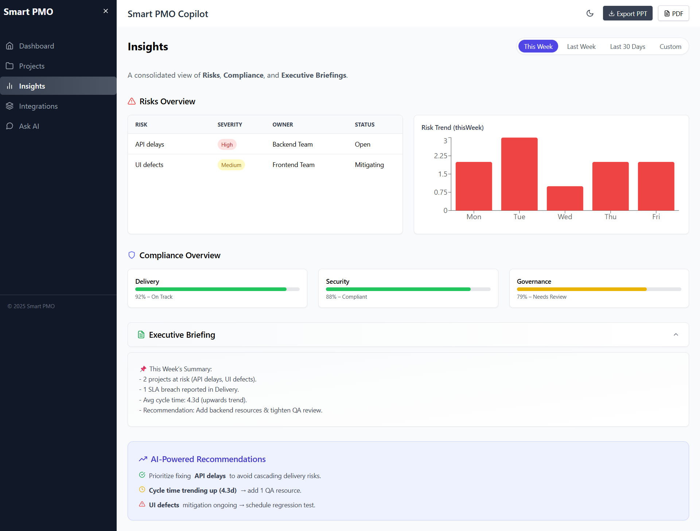
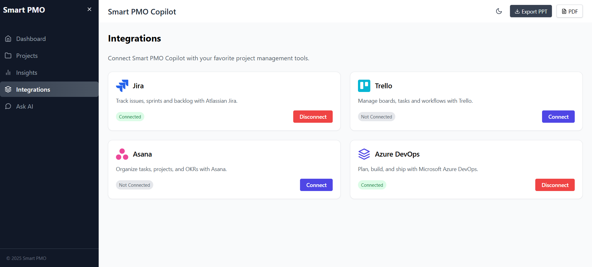

# Smart PMO Copilot – Frontend  

  
  
  
  

Smart **PMO Copilot** is an **AI-powered Project Management & Risk Monitoring Dashboard** built with **React + TailwindCSS + Recharts**.  

It helps **Project Managers, PMOs, and Engineering Leaders** with:  
📊 **Real-time project health** → risks, sprints, blockers, compliance.  
🤖 **AI Copilot** → auto-summaries, insights, recommendations.  
📑 **Exportable Reports** → download insights as **PDF/PPT** instantly.  

---

## ✨ Features (Current Version)

- 📊 **Dashboard** → Task status, sprint timeline, project health gauge, risk heatmap, SLA breaches, forecast alerts.  
- 📂 **Projects Page** → AI summaries, completion %, milestones, risk scores, Gantt charts, recommendations.  
- 💬 **Ask AI Chat** → Conversational AI assistant for queries (risks, blockers, reports).  
- 🔗 **Integrations** → Mock connections for Jira, Trello, Asana, Azure DevOps.  
- 📑 **Insights Page** → Combined **Risks**, **Compliance**, and **Executive Briefings** with AI-powered recommendations.  
- 📑 **Export Options** → Export dashboards & chat insights as **PPT** or **PDF**.  
- 🎨 **Modern UI** → Responsive TailwindCSS layout, mobile + desktop ready.  

---

## 🖼 Screenshots  

### Dashboard  
  

### Projects  
  

### Chat (Ask AI)  
  

### Insights  
  

### Integrations  
  

---

## 🛣 Roadmap (Next Steps for SaaS)

- [x] 📱 **Step 1: Mobile Responsive UI & Pages (DONE)**  
- [ ] 🔗 **Step 2: Authentication (JWT/OAuth2)**  
- [ ] 🏢 **Step 3: Multi-Tenant Support** (multiple orgs, roles: Admin, PM, Analyst).  
- [ ] 🤖 **Step 4: AI Features** →  
   - Risk prediction  
   - Sprint summaries  
   - Automated compliance checks  
   - Auto-email notifications  
- [ ] ☁️ **Step 5: Deployment Ready** → Docker + CI/CD + Vercel/Netlify builds.  

---

## 🛠 Tech Stack  

- **Frontend** → React, TailwindCSS, Recharts  
- **State Management** → React Hooks  
- **Exports** → jsPDF, pptxgenjs (for PDF/PPT)  
- **Routing** → React Router  
- **Deployment (planned)** → Vercel / Netlify / Docker  

⚡ Note: This is the **frontend-only demo**. Backend (FastAPI/Node.js) + database (PostgreSQL) will be added in future.  

---

## 🚀 Setup Instructions  

### 1. Clone Repository  
```bash
git clone https://github.com/ankit72630/smart-pmo-copilot.git
cd smart-pmo-copilot
```

### 2. Install Dependencies  
```bash
npm install
```

### 3. Run Locally  
```bash
npm start
```

👉 App runs at [http://localhost:3000](http://localhost:3000)  

---

## 🤝 Contribution  

Contributions, issues, and feature requests are welcome! 🎉 

1. Fork this repo  
2. Create a feature branch → `git checkout -b feature-name`  
3. Commit changes → `git commit -m "Add feature"`  
4. Push → `git push origin feature-name`  
5. Open a Pull Request  

---

## 📦 Deployment  

You can deploy easily with **Vercel** or **Netlify**.  

**Deploy to Vercel**  
```bash
npm run build
vercel deploy
```  

**Deploy to Netlify**  
```bash
npm run build
netlify deploy
```  

---

## 📜 License  

This project is licensed under the **MIT License** — free for personal & commercial use.  

---

## 💡 Why This Project is Valuable  

💼 Ready-to-use **PMO Dashboard** (managers love it).  
🎯 Built with modern stack (React, Tailwind, Recharts).  
📑 Export-ready → buyers see immediate value in reporting.  
⚡ Can be extended to SaaS with minimal backend additions.  
